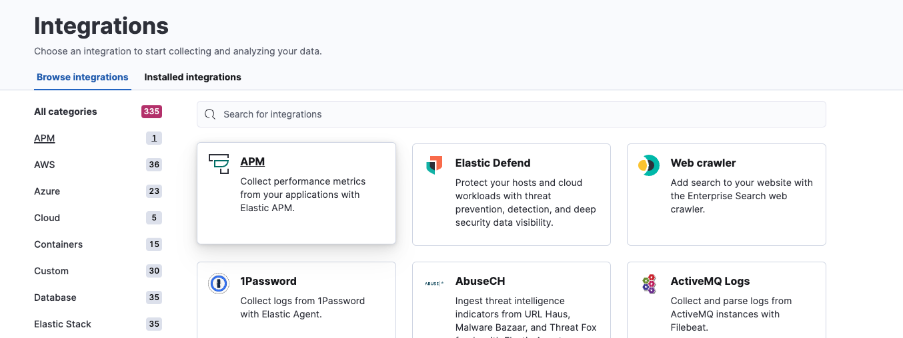
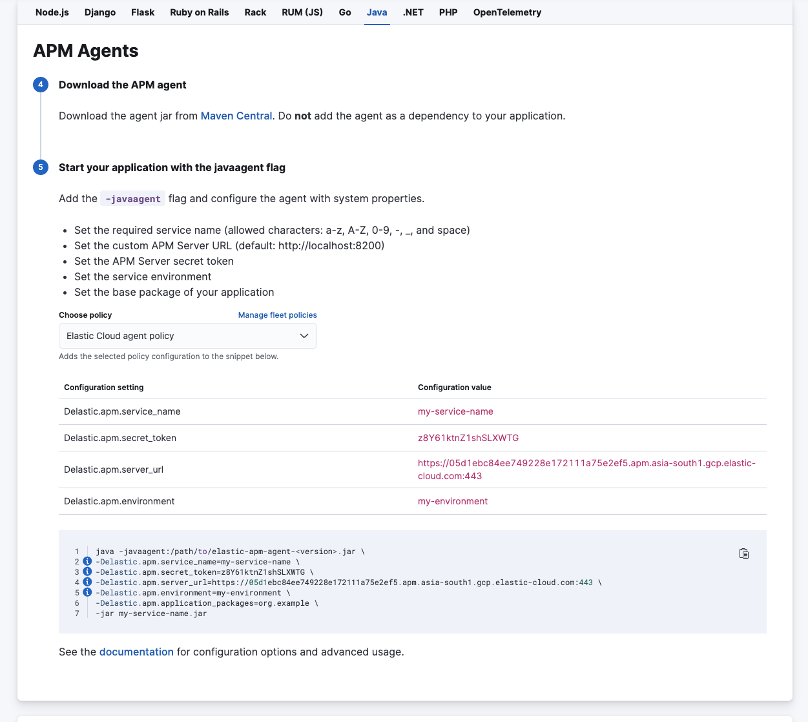
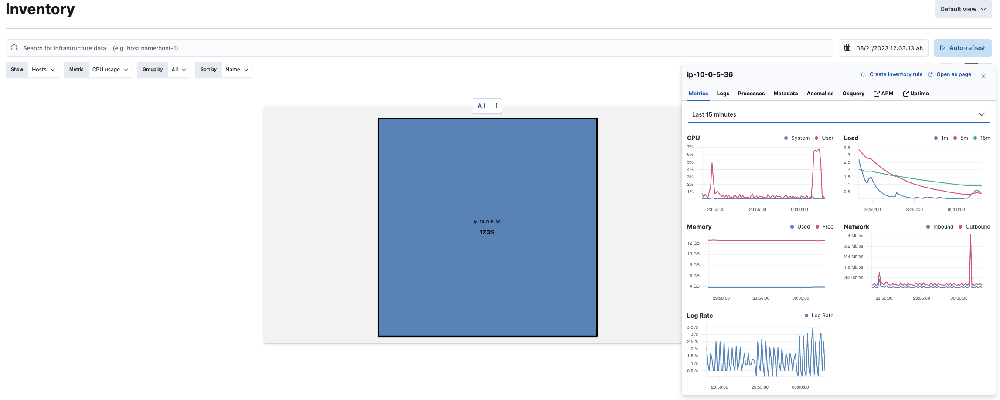
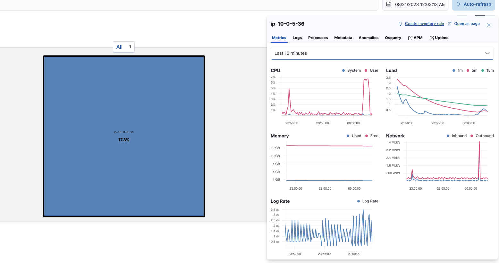

# Lab 4

We now start with Lab 4. The pre-requisites remain the same as for Lab 1.

This lab will cover instrumenting and observing two applications, one a monolith and next a microservices application. Second section of the lab will cover alerting.

---
### Elastic APM Setup

We will be using the same Elastic Cloud instance provisioned earlier.


1. Login to your Elastic Cloud Instance and navigate to APM
    

2. You will see options to configure your application with Elastic APM. Go to the Java setup to begin with.
   
   Download the agent jar as instructed on the page.
3. Now login to your Lab VM and clone the spring boot application we intend to instrument.
   
   ```bash
      #Java should already be installed. If not run the following command.
      sudo apt install openjdk-17-jdk -y
   ```
   Next clone the application from GitHub. [Spring Pet Clinic](https://github.com/spring-projects/spring-petclinic)

   ```bash
      mkdir -p lab4
      cd lab4
      git clone https://github.com/spring-projects/spring-petclinic.git
      cd spring-petclinic
      export JAVA_HOME=/usr/lib/jvm/java-17-openjdk-amd64
      ./mvnw package
      java -javaagent:/path/to/elastic-apm-agent-<version>.jar \
      -Delastic.apm.service_name=petclinic \
      -Delastic.apm.secret_token=XXXXXXX \
      -Delastic.apm.server_url=XXXXXXX \
      -Delastic.apm.environment=o11y-workshop \
      -jar target/spring-petclinic-3.1.0-SNAPSHOT.jar
   ```   
   Once the application starts running, access the URL with the FQDN or IP address of the lab machine at port 8080.
   
   http://lab-machine-fqdn-or-url:8080/

   Interact with the application. 

4. Navigate to APM screen. Check Inventory, Service Map, Traces etc. 
   What do you see? 

5. Next lets deploy a microservices version of the petclinic application. Cleanup the previous run.
6. Copy the [docker-compose](./docker-compose.yml) file to your lab machine.
   ```bash
      mkdir -p lab4/apps
      cd lab4/apps
      docker-compose up -d
   ```
7. Once the application is up and running interact with it using the url http://lab-machine-fqdn-or-url:8080/
8. You should see data being populated in Elastic.
   
9.  As you interact with it, Repeat step 4. What do you see? How does the service map look?

___

## Alerting
1. We have already installed Elastic Agent from Lab 2. We will be using the same setup.
2. Run the following command
   ```bash
      docker run -it --name cpustress --rm containerstack/cpustress     --cpu 1 --timeout 300s --metrics-brief
   ```
   This will run stress-ng with cpu stressors for 5 mins.
3. Navigate to the Inventory page.
   
   You should see the spike in CPU utilization.
4. Create an inventory rule.
   
5. Create an email alert to notify on High CPU.

>                        End Of Lab 4.


