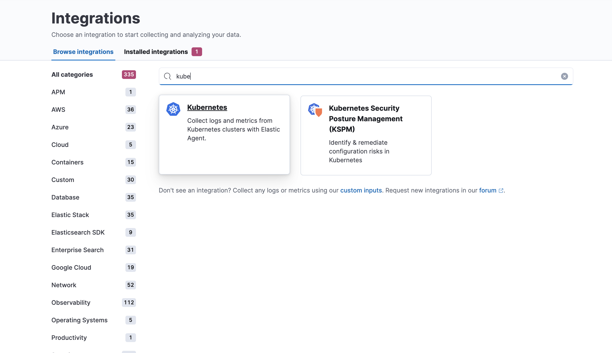
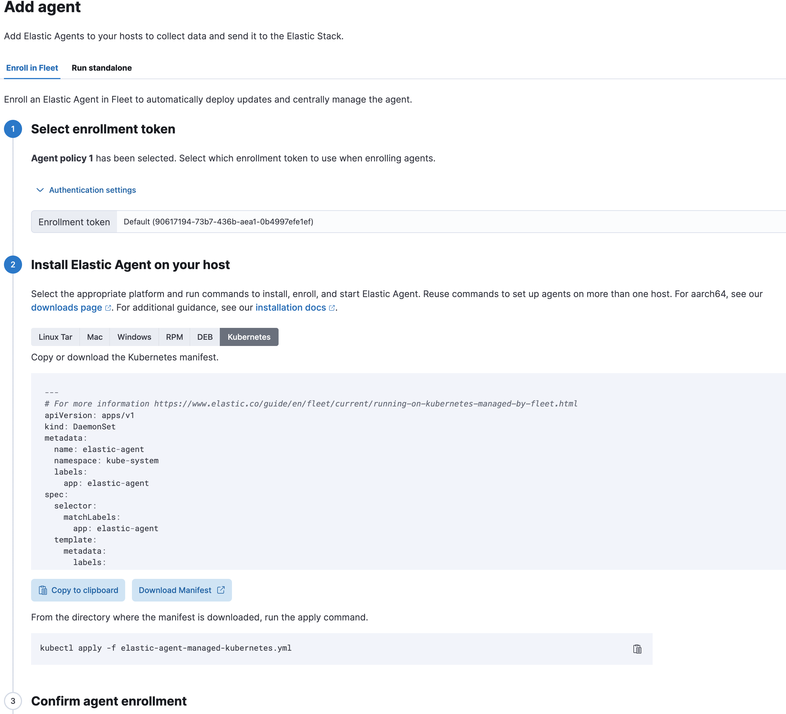

# Lab 5

We now start with Lab 5. The pre-requisites remain the same as for Lab 1.

This lab will cover instrumenting and observing K8 and applications on K8.

---
### K8s Monitoring.

We will be using the same Elastic Cloud instance provisioned earlier.

1. Minikube Setup.
   ```bash
   # Install minikube
   curl -LO https://storage.googleapis.com/minikube/releases/latest/minikube_latest_amd64.deb
   sudo dpkg -i minikube_latest_amd64.deb

   # Start minikube
   minikube start
   ```
2. Helm Setup
   ```bash
   # Install helm
   curl https://raw.githubusercontent.com/helm/helm/master/scripts/get-helm-3 | bash
   ```
3. Kubectl setup
   ```bash
   # Install kubectl
   curl -LO https://storage.googleapis.com/kubernetes-release/release/$(curl -s https://storage.googleapis.com/kubernetes-release/release/stable.txt)/bin/linux/amd64/kubectl
   chmod +x kubectl
   sudo mv kubectl /usr/local/bin/
   ```
4. Kube State Metrics Setup.
   ```bash
   # Install kube state metrics
   git clone https://github.com/kubernetes/kube-state-metrics
   cd kube-state-metrics
   kubectl apply -f examples/standard/
   ```
5.  Login to your Elastic Cloud Instance and navigate to Integrations.
      
    
    Follow through the instructions and you will land at the screen which prompts you to install the Elastic agent in your kubernetes cluster.
   
      

---
### Otel Demo App on Minikube.

1. Setup secrets on K8.
   ```bash
      kubectl create secret generic elastic-secret --from-literal=elastic_apm_endpoint='YOUR_APM_ENDPOINT_WITHOUT_HTTPS_PREFIX' --from-literal=elastic_apm_secret_token='YOUR_APM_SECRET_TOKEN'
   ```
2. Clone the Demo Repo.
   ```bash
      mkdir lab5/k8-monitoring
      cd lab5/k8-monitoring
      git clone https://github.com/elastic/opentelemetry-demo
      cd opentelemetry-demo
   ```
3. Execute following steps to deploy app to minikube.
   ```bash
      # switch to the kubernetes/elastic-helm directory
      cd kubernetes/elastic-helm

      # add the open-telemetry Helm repostiroy
      helm repo add open-telemetry https://open-telemetry.github.io/opentelemetry-helm-charts

      # deploy the demo through helm install
      helm install -f values.yaml my-otel-demo open-telemetry/opentelemetry-demo

   ```
4. To access the application run the following command.
   ```bash
      kubectl port-forward svc/my-otel-demo-frontendproxy 8080:8080 --address='0.0.0.0'
   ```
   Once the application starts running, access the URL with the FQDN or IP address of the lab machine at port 8080.
   
   http://lab-machine-fqdn-or-url:8080/
>                        End Of Lab 5.

